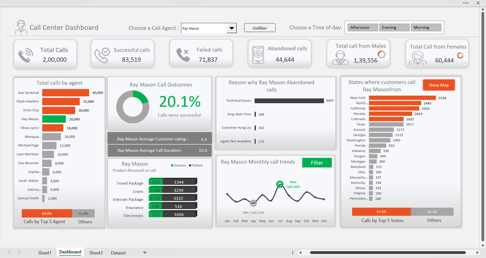

# 📞 Call Center Dashboard using Microsoft Excel

## 📊 Overview
This project showcases an **interactive and insightful Call Center Dashboard** built entirely in **Microsoft Excel**.  
The dashboard provides a clear picture of overall call performance, agent efficiency, customer demographics, and call outcomes — helping businesses identify key trends and areas for improvement.

---

## 🧰 Tools & Technologies Used
- **Microsoft Excel**
  - Pivot Tables  
  - Data Validation (Dropdowns)  
  - Macros - VBA 
  - Charts & Graphs  
  - Slicers and Filters  
  - KPI Cards  

---

## 📂 Dataset Details
The dataset includes **call records** with various attributes such as:
- `Call_ID`  
- `Date`  
- `Agent_First_Name`, `Agent_Last_Name`, `Agent_Full_Name`  
- `Agent_Rating`  
- `Product_Discussed`  
- `Call_Duration_Minutes`  
- `Call_Outcome` (Success / Failure / Abandoned)  
- `Customer_Age`, `Customer_Gender`, `Customer_Income_Bracket`  
- `State`  
- `Time_of_Day`  
- `Follow_Up_Call_Required`, `Repeat_Customer`  
- `Reason_Call_Abandoned`  

---

## 📈 Dashboard Features
### 🔹 Key Performance Indicators (KPIs)
- **Total Calls**: 2,00,000  
- **Successful Calls**: 83,519  
- **Failed Calls**: 71,837  
- **Abandoned Calls**: 44,644  
- **Calls by Gender**: Males – 1,39,556 | Females – 60,444  

### 🔹 Visual Insights
- **Total Calls by Agent** – identifies top-performing agents.  
- **Call Outcomes by Agent** – success rate visualization.  
- **Abandoned Call Reasons** – common issues like *Technical Errors* or *Long Wait Time*.  
- **Calls by State** – top states where customers call from.  
- **Product Discussed on Calls** – most popular services like *Loans*, *Internet Packages*, etc.  
- **Monthly Call Trends** – identifies performance peaks and drops across months.  

---

## 🎯 Insights & Findings
- **Ava Sandoval** and **Elijah Hawkins** are top-performing agents by total calls handled.  
- Most **abandoned calls** are due to **Technical Issues**.  
- **Loans** and **Internet Packages** are the most discussed products.  
- **New York** and **California** contribute the highest number of customer calls.  
- Majority of calls are handled by **male customers**, with peak activity during **afternoon hours**.  

---

## 💡 Key Learnings
- Building **interactive dashboards** using Excel’s visualization and analysis tools.  
- Designing **dynamic reports** using slicers, filters, and conditional formatting.  
- Translating raw datasets into **business insights** that improve decision-making.  
- Strengthening understanding of **data storytelling** through clean and impactful visuals.

---

## 🖼️ Dashboard Preview

## 👨‍💻 Author
**Akshay Kumar S**  
Data Enthusiast | Excel | Power BI | SQL | Python | Data Analytics
⭐ If you like this project, consider giving it a **star** on GitHub!

